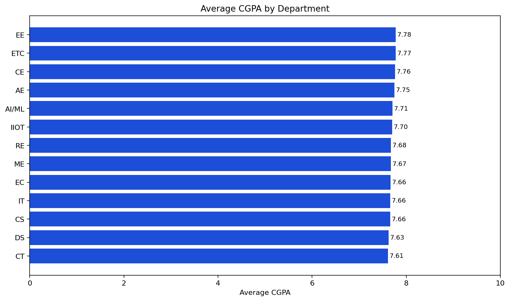
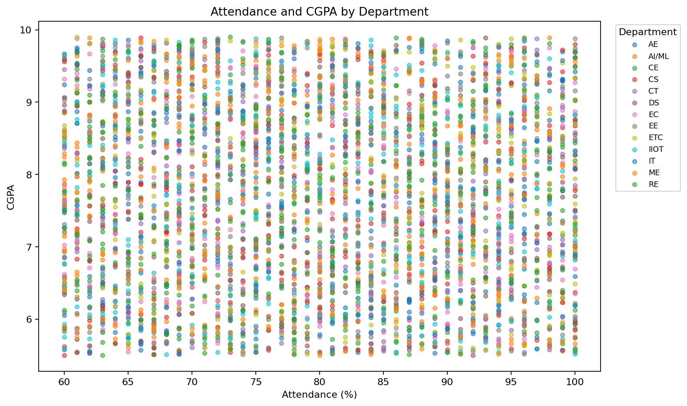

# Student Performance Analytics

A student analytics portfolio project built with a fully synthetic Faker dataset. It turns student performance records into department-level indicators and includes a simple, reproducible CGPA baseline model in a Streamlit dashboard.

## What this project demonstrates

- Data quality checks and standardisation for CGPA and attendance
- Department-level performance analysis and review indicators
- Student-record lookup by roll number and name, top-performer highlighting, and club participation analysis
- A tested baseline model using department, year, semester, and attendance
- A deployable Streamlit dashboard with filtering and an interactive estimate form
- A full, clearly labelled synthetic dataset for testing, practice, and demonstrations

## Project structure

```text
student-performance-analytics/
├── app.py                    # Streamlit dashboard
├── assets/outputs/            # Charts generated from the sample data
├── data/
│   ├── student_records_synthetic.csv  # Full Faker-generated demo dataset
│   └── student_performance_sample.csv # Compact analytics-only sample
├── src/                      # Processing, metrics, and model modules
├── tests/                    # Automated tests
└── archive/                  # Original scripts and visual assets, retained locally for reference
```

## Run locally

```bash
python -m venv .venv
.venv\Scripts\activate
pip install -r requirements.txt
pytest
streamlit run app.py
```

If PowerShell blocks virtual-environment activation, run this once in the same terminal before activating it:

```powershell
Set-ExecutionPolicy -Scope Process -ExecutionPolicy Bypass
```

Open the local URL printed by Streamlit, usually `http://localhost:8501`.

## Example outputs

These charts are generated from the versioned synthetic dataset.





## Model note

The model is a baseline estimator, not a production decision system. The dashboard reports holdout MAE and R² so its limits are visible. Do not use it for admissions, scholarships, discipline, or other high-stakes decisions without a fuller validation and governance process.

## Data note

`data/student_records_synthetic.csv` was generated with Python's Faker library for this project. Names, email addresses, phone numbers, addresses, and family details are fictional. It is included intentionally so recruiters, learners, and reviewers can run the ERP without needing real college data. Do not replace it with real student records in a public repository.

## Deploy

Push this folder to GitHub, then create a Streamlit Community Cloud app with `app.py` as the entry point. Install dependencies from `requirements.txt`.
